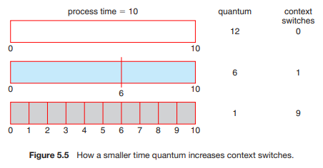
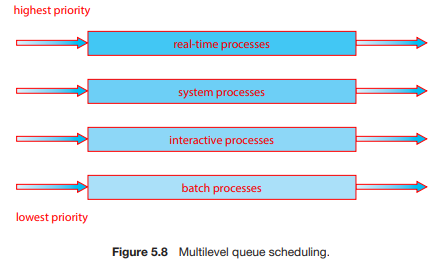
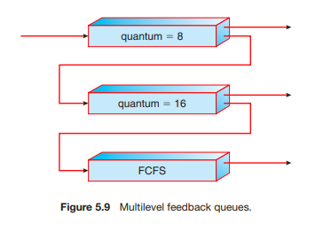

# 0211 스터디

## 5.2 스케줄링 기준

- 디스패치(Dispatch) - 운영체제가 프로세스를 프로세서에 할당하는 것 (이때 프로세스 상태가 `ready`에서 `running`으로 변경)

- 운영체제가 레디 큐(Ready queue)에 있는 프로세스들 중에서 어떤 프로세스를 디스패치할 것인가 정하는 것이 프로세스 스케줄링(Process scheduling)

- 스케줄링 알고리즘 평가 기준

  - CPU 이용률(%) - 실제 시스템에서 40% ~ 90% 까지의 이용률을 가짐

  - 처리량(throughput) - (완료된 프로세스의 개수) / (단위 시간)

  - 총 처리 시간 - 프로세스를 처리하는데에 걸리는 시간

    (레디 큐에서 대기하는 시간) + (CPU에서 실행하는 시간) + (I/O 시간)

  - 대기 시간 - 프로세스가 레디 큐에서 대기한 시간

  - 응답 시간 - 프로세스가 처음으로 CPU를 할당받기까지 걸린 시간

##  5.3 스케줄링 알고리즘

### 5.3.1 선입 선처리 스케줄링(FCFS, First-Come, First-Served)

- 먼저 들어온 프로세스를 먼저 프로세서에 할당하는 방식
- Queue의 FIFO(First-In First-Out)와 동일
- 구현이 쉬워서 간단한 시스템에 자주 사용
- 프로세스 처리 순서에 따라 성능이 크게 변동
- 수행 시간이 큰 프로세스가 먼저 들어오면 그 뒤에 들어온 프로세스들이 불필요하게 오랜 시간을 기다리게 되는 호위 효과(Convoy effect) 발생할 수 있음
- 먼저 온 프로세스가 끝날 때까지 운영체제가 개입하지 않는 **비선점 스케줄링 방식**

###  5.3.2 최단 작업 우선 스케줄링(SJF, Shortest Job First)

- 프로세스의 수행 시간이 짧은 순서에 따라 프로세서에 할당
- FCFS에서 발생하는 호위 효과를 해결할 수 있음
- 최적 알고리즘이지만 수행 시간을 정확히 알 수 없음 (앞서 처리한 프로세스들의 기록을 보고 추측 - 지수 평균)
- 버스트 시간이 큰 프로세스는 계속 뒤로 밀려나는 기아(Starvation) 발생할 수  있음
- 버스트 시간이 짧은 프로세스가 끝날 때까지 운영체제가 개입하지 않는 **비선점 스케줄링 방식**
  - 선점형 SJF 방식도 존재 (최소 잔여 시간 우선 스케줄링)
    - 프로세스의 남은 수행 시간이 짧은 순서에 따라 프로세서에 할당
    - SJF에서 발생하는 기아 문제를 (부분적으로)해결할 수 있음 - 계속해서 짧은 프로세스가 들어올 때
    - 수행 중 다른 프로세스보다 남은 수행 시간이 적어지면 운영체제가 개입해 자리를 바꾸는 **선점 스케줄링 방식**

### 5.3.3 라운드 로빈 스케줄링(Round-Robin)

- 일정 시간 할당량(Time quantum) 단위로 여러 프로세스를 번갈아가며 프로세서에 할당
- 시스템의 time-sharing과 같은 방식
- 반응성이 좋음
- 주로 우선순위 스케줄링(Priority scheduling)과 결합해 프로세스의 시간 할당량을 조절하는 방식으로 활용
- 시간 할당량에 따라 운영체제가 계속 개입하는 **선점 스케줄링 방식**
- 시간 할당량이 적을수록 문맥 교환 횟수가 늘어나기 때문에 큰 것이 좋지만 너무 크다면 FCFS 방식과 같아짐.

### 5.3.4 우선순위 스케줄링(Priority)

- 특정 기준으로 프로세스에게 우선순위를 부여해 우선순위에 따라 프로세서에 할당
- 프로세스를 에이징(Aging)해서 오래 대기한 프로세스의 우선순위를 높이는 방식으로 사용
- SRF의 경우 남은 수행 시간을 기준으로 우선순위를 부여한다고 할 수 있음
- 낮은 우선순위 프로세스들이 무한히 대기하는 무한 봉쇄(Indefinite blocking) 혹은 기아(Starvation)가 발생할 수 있음 - 무한 봉쇄를 해결하기 위해 노화(Aging)을 사용
- 다른 스케줄링 알고리즘과 결합해 사용할 수 있으므로 **선점, 비선점 모두 가능**

### 5.3.5 다단계 큐 스케줄링(Multilevel Queue)

- 우선순위와 라운드 로빈 방식 모두 단일 큐를 사용 

  -> 우선 순위 기준이 다른 여러 큐를 두어 각각의 우선순위에 맞게 스케줄링하는 방식이 효율적

- 예) 포그라운드 프로세스와 백그라운드 프로세스를 구분하여 사용

### 5.3.6 다단계 피드백 스케줄링(Multilevel Feedback Queue)

- 프로세스가 큐들 사이를 이동하는 것을 허용
- 다단계 피드백 큐 스케줄러를 정의하는 매개변수
  - 큐의 개수
  - 각 큐를 위한 스케줄링 알고리즘
  - 한 프로세스를 높은 우선순위 큐로 올려주는 시기를 결정하는 방법
  - 한 프로세스를 낮은 우선순위 큐로 강등시키는 시기를 결정하는 방법
  - 프로세스에 서비스가 필요할 때 프로세스가 들어갈 큐를 결정하는 방법
- 매개변수 조정이 필요하기 때문에 가장 복잡한 알고리즘

## 5.4 스레드 스케줄링

대부분의 최신 운영체제에서 스케줄되는 대상은 프로세스가 아닌 커널 수준의 스레드

### 5.4.1 경쟁 범위(Contention Scope)

- 다대일과 다대다 모델을 구현하는 시스템에서는 스레드 라이브러리는 사용자 수준 스레드를 가용한 LWP(스레드) 상에서 스케줄링
- 이러한 기법은 동일한 프로세스에 속한 스레드들 사이에서 CPU를 경쟁하기 때문에 **프로세스-경쟁-범위(Process-Contention scope, PCS)**로 알려짐
- CPU상에 어느 커널 스레드를 스케줄 할 것인지 결정하기 위해서 커널은 **시스템-경쟁-범위(System-Contention Scope, SCS)**를 사용
- Windows와 Linux 같은 일대일 모델을 사용하는 시스템은 오직 SCS만을 사용하여 스케줄링
- 전형적으로 PCS는 우선순위에 따라 행해짐. 즉 스케줄러는 가장 높은 우선순위를 가진 실행 가능한 프로세스를 선택

### 5.4.2 Pthread 스케줄링(Pthread Scheduling)

Pthreads는 다음과 같은 범위의 값을 구분한다.

- PTHREAD SCOPE PROCESS 는 PCS 스케줄링을 사용하여 스레드를 스케줄한다.

- PTHREAD SCOPE SYSTEM 는 SCS 스케줄링을 사용하여 스레드를 스케줄한다.