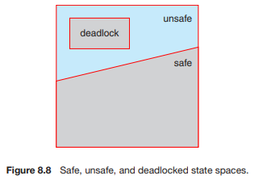
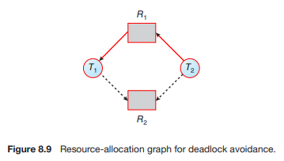
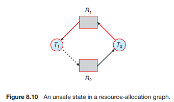
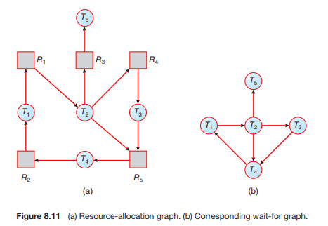

# 0218 스터디

## 8.6 교착 상태 회피 (Deadlock Avoidance)

- Deadlock 예방 알고리즘은 요청 방법에 제한을 두어 Deadlock을 예방함.
  - Deadlock 필요조건을 제한
    - 이 방식은 장치의 이용률과 시스템 총처리율이 감소
  
- 이에 대한 대안으로 동적으로 리소스 할당 상태를 검사하여 미래의 상태를 예측해서 회피하는 알고리즘 개발

  

### 8.6.1 안전 상태 (Safety State)

- 시스템이 안전하다. = 시스템이 스레드들이 요청하는 모든 자원을 Deadlock 없이 차례로 할당 가능하다. 

  = 시스템이 안전 순서를 찾을 수 있다.

  

- 시스템이 안전 상태에만 있도록 하는 **회피** 알고리즘은 Deadlock을 완벽히 방지할 수 있지만 **예방** 알고리즘과 마찬가지로 자원의 이용률이 감소

### 8.6.2 자원 할당 그래프 알고리즘 (Resource-Allocation Graph Algorithm)

- 자원 할당 그래프에서 요청 간선과 할당 간선에 예약 간선을 추가하여 사용
  - 그래프에 사이클이 없을 때만 안전상태임을 이용

 

### 8.6.3 은행원 알고리즘 (Banker's Algorithm)

- 은행원들이 돈을 꼬이지 않고 잘 찾아주는 것에서 유래 - 사업이 안전할 때만 돈을 대출해주는 방법
  - 프로세스가 자원을 요청했을 때 자원을 줄지 말지 결정하는 알고리즘

- **안정성 알고리즘(Safety Algorithm)**과 **자원 요청 알고리즘(Resource-Request Algorithm)**을 이용

#### 안정성 알고리즘 (Safety Algorithm)

1. Work = Available로 초기 값을 준다. i = 0, 1, 2, ..., n-1에 대해 Finish[i] = False를 초기 값으로 준다.

2. 아래 두 조건을 만족시키는 i 값을 찾는다.

   a. Finish[i] == False

   b. Need[i] <= Work

   그러한 i를 찾을 수 없다면 4번으로 간다.

3. Work = Work + Allocation[i]

   Finish[i] = True

   2번으로 간다.

4. 모든 i 값에 대해 Finish[i] == True이면 이 시스템은 안전상태이다.

#### 자원 요청 알고리즘 (Resource - Request Algorithm)

1. Request[i] <= Need[i]이면 2번으로 간다. 아니라면 오류로 처리한다.

2. Request[i] <= Available이면 3번으로 간다. 아니라면 P[i]는 기다려야 한다.

3. 자원 할당했을 때로 정보를 바꿔준다

   ​	Available = Available - Request[i]

   ​	Allocation[i] = Allocation - Request[i]

   ​	Need[i] = Need[i] - Request[i]

4. 안정성 알고리즘을 돌려 안전상태라면 자원을 할당한다. 불안전하다면 T[i]는 기다려야 한다.

## 8.7 교착 상태 탐지 (Deadlock Detection)

- 기본적으로 Deadlock을 **예방**하거나 **회피**하는 경우 CPU 사용률이 떨어지는 것은 필연적
- 따라서 Deadlock이 **절대** 발생해서는 안되는 경우이거나 자주 발생하는 경우가 아니라면 발생하도록 허용한 후 탐지하여 회복하는 방법을 사용

### 대기 그래프(wait-for graph)

- 각 자원 유형이 한 개씩 있는 경우 어떤 프로세스가 어떤 리소스를 기다리고 있는지 체크하는 그래프
- 사이클이 존재하면 Deadlock을 Detection

### 각 유형의 자원을 여러개 가진 경우

- 대기 그래프를 사용할 수 없을 때는 은행원 알고리즘과 비슷한 방법 사용

### 8.7.3 탐지 알고리즘 사용 (Detection Algorithm Usage)

- 위에서 설명한 탐지 알고리즘은 Deadlock의 **발생 빈도**에 따라 돌린다. (자주 일어날 수록 탐지도 자주 실행)
- 통상적으로 몇개의 스레드가 Deadlock에 연루되는지도 생각해야한다.

