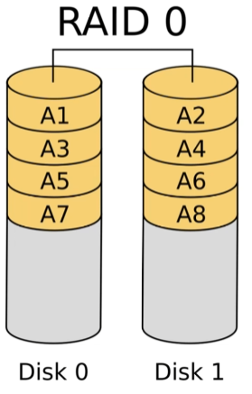

# 0304 스터디

## 11.5 저장장치 관리 (Storage Device Management)

### 드라이브 포매팅, 파티션, 볼륨

- 드라이브 포매팅  - 물리적 블록 주소를 논리 블록 주소로 바꿔줄 수 있는 최소한의 하드웨어 관리

  

- 파티션 

  - 그룹으로 나누어 별도의 장치처럼 취급하는 작업
  - 파티션 하나에 하나의 파일 시스템 탑재
  - 일반적으로 C드라이브 -> D드라이브 -> E드라이브...등의 이름으로 지정
  - C드라이브에는 OS 관련 데이터만 설치할 것을 권고
  - 마운트
    - 하나의 하드디스크는 하나의 파티션으로 분류되는게 일반적
    - 유닉스 운영체제는 여러개의 하드디스크를 하나의 파티션으로 묶을 수 있는 기능을 제공하기도 하는데, 이를 마운트라고 지칭

- 포매팅

  - 디스크를 초기화하는 작업
  - 파일 시스템을 각 파티션의 상단부에 탑재하고, 저장 장치의 모든 섹터를 0으로 만들어 운영체제가 사용 할 수 있도록 준비하는 작업
  - 가상 메모리 시스템에서, 가상 주소를 물리 주소로 변환하기 위해 페이지 테이블을 사용
  - 저장 장치도 마찬가지로, 디스크에 저장된 파일의 위치와 크기 정보를 담고 있는 파일 테이블을 사용
  - 운영체제마다 고유의 파일 테이블이 있음 ( Window → FAT / NTFS … , Unix → I-node … )
  - 빠른 포매팅
    - 데이터는 그대로 둔 채 파일 테이블을 초기화 하는 방식
  - 느린 포매팅
    - 모든 섹터를 0으로 만드는 작업
    - 하드디스크를 처음 사용 할 때 주로 사용
    - 배드 섹터를 찾고 싶다면, 느린 포매팅을 해야 함

### 손상된 블록 관리

디스크 전체가 고장나는 경우도 있지만, 보통 몇몇개의 섹터에 결함이 생김

이를 복구하기 위한 방법

- 전체 디스크를 훑으며 손상된 부분 블록처리
- 섹터 밀어내기

## 11.6 스왑 공간 관리 (Swap-Space Management)

현대에는 스와핑과 가상 메모리 기법을 함께 고려해 전체 프로세스가 아닌 페이지들을 스왑

### 스왑공간 사용

- 스왑 공간은 예상보다 크게 잡는 것이 안전

### 스왑공간 위치

- 일반 사용자 공간 내에 생성
  - 관리가 편함
- 별도의 raw 파티션 할당
  - 속도 효율성 최적화된 알고리즘 사용
  - 스왑 공간을 늘리려면 새로 생성 or 다른 장소에 만들어야 하므로 관리가 불편

### 리눅스 예

- 파일에 대한 페이지라면 스왑 공간으로 스왑아웃(swap-out) 시키기보다 그냥 덮어씀
- 스왑 공간은 스택이나 힙 등의 익명 메모리를 위한 공간

## 11.7 저장장치 연결 (Storage Attachment)

컴퓨터는 호스트에 연결하는 방식, 네트워크로 연결된 저장장치, 클라우드 저장장치 등의 3가지 방법으로 보조저장장치에 접근

### 호스트 연결 저장장치 (Host-Attached Storage)

- 로컬 I/O 포트를 통해 엑세스 - SATA 등

### 네트워크 연결 저장장치 (Network-Attached Storage)

- 네트워크(LAN / WAN)를 통해 엑세스 - ex) 회사 Lan을 이용한 공유

### 클라우드 저장장치 (Cloud Storage)

- 네트워크 연결 저장장치(NAS)와의 차이점은 NAS는 실제로 마운트되지만, 클라우드는 API를 통한 통신

  ex) 클라우드 서비스

- NAS는 LAN에서 사용할 것을 전제로 하여 WAN보다 속도가 빠르고 저장장치 사용자와 장치 간의 연결이 끊어질 확률이 낮음 <-> 클라우드는 속도가 느리지만 저장 공간이 외부에 있어 용량의 제한이 없음

### SAN (Storage-Area Network)

- 여러 서버 또는 컴퓨터에서 액세스할 수 있는 저장장치 네트워크로, 공유 풀을 제공

- 네트워크의 각 장치는 직접 연결된 로컬 디스크처럼 SAN 저장장치에 액세스 가능

  

## 11.8 RAID 구조 (RAID Structure)

### **RAID** (**R**edundant Array of **I**ndependent(**I**nexpensive) **D**isk) 

독립된 디스크의 복수 배열

- 값 싼(용량이 작은) 여러개의 디스크를 하나의 논리 디스크처럼 사용하는 방법
  - 동시에 병렬적으로 시스템을 운영하면 데이터 읽기, 쓰기 비율을 향상시킬 수 있음
  - 하지만 하나만 고장나더라도 시스템 전체가 고장나기 때문에 위험도 증가
  - 이를 방지하기 위해 여러가지 구조 존재

### RAID 레벨

- 레벨 0

  - 쓰기 / 읽기 속도 2배
  - 둘 중 하나가 오류가 생기면 손상되기 때문에 안정성 떨어짐

  

  

- 레벨 1

  - 하나의 디스크의 정보를 다른 디스크에 복사

  - 쓰기 / 읽기 속도 동일

  - 둘 중 하나가 고장이 나도 데이터 복구 가능

  - 안정성이 디스크의 수 만큼 늘어남

    

- 레벨 5

  - 레벨 0, 1을 섞은 절충안 (속도와 안정성)

  - 패리티(parity) 비트를 사용함 - 레벨 2, 3, 4은 하나의 디스크에 패리티비트를 모아두지만, 레벨 5는  여러개의 디스크에 패리티비트를 분산하여 저장

    

- 레벨 0 + 1 vs 레벨 1 + 0

  - RAID 1 + 0
    - 속도 2배

  

  

  - RAID 0 + 1

### 장애 허용 시스템 (Fault tolerance)

시스템을 구성하는 부품의 일부에서 결함이나 고장이 발생하여도 정상적 혹은 부분적으로 기능을 수행할 수 있는 시스템

### RAID의 문제점

- 융통성 부족
  - 하나의 파일 시스템이 RAID 집합보다 크기가 큰 경우 / 파일 시스템이 매우 적은 공간만을 필요로 할 경우
- 대안으로 ZFS 시스템 사용 가능

