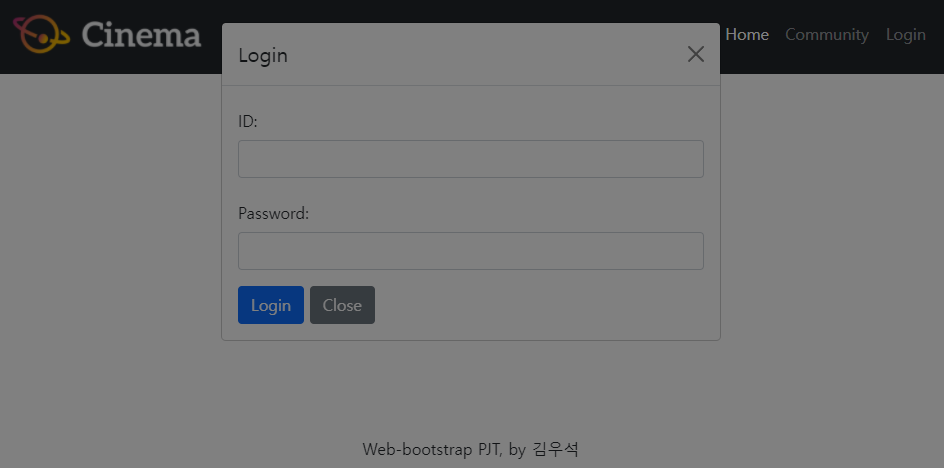
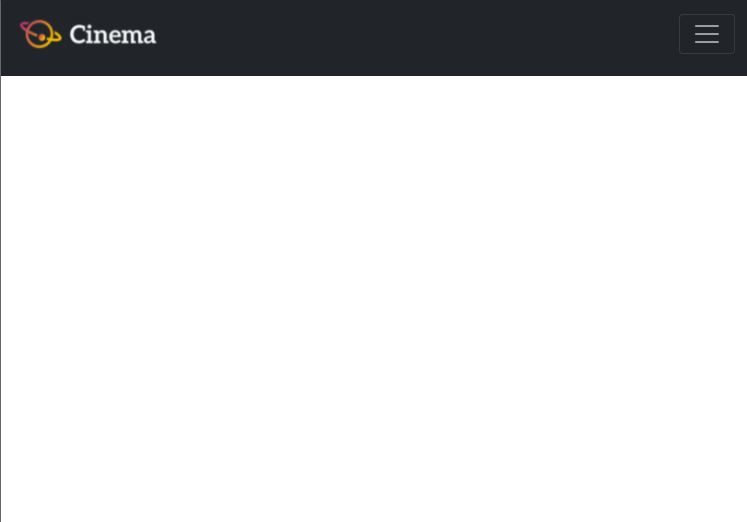

# Boostrap을 반응형 웹페이지 구성

## 목표

-   HTML을 통한 웹 페이지 마크업 분석
-  CSS 라이브러리의 이해와 활용
-  컴포넌트 및 그리드 시스템 활용
-  커뮤니티 서비스 반응형 레이아웃 구성 

1.  네비게이션 바와 푸터(Footer)를 구성하는 문제였다.

   이 문제는 저번 웹 수업시간에 배운 Cinema 페이지 구성하는 것과 유사해서 쉽게 할 수 있을 것이라 생각했다.

   먼저 저번 시간에 한 기억을 되살려 `flex`를 이용해  배치를 마치고, 링크와 Modal 컴포넌트까지 구현하는 것까지 성공했다.

   그런데 문제를 다시 보니 창 크기에 따라 **햄버거 모양**의 메뉴바가 생겨야 하는 것 아닌가...?!

   급하게 Bootstrap 홈페이지에서 메뉴 바를 검색하니 navbar라는 것이 있어서 원하는 양식을 복사 붙여넣기 한 후 양식에 내가 전에 작성한 코드를 집어 넣었다.

   역시 Bootstrap은 편하다!! **라고 생각하던 순간,,,** 여기저기서 오류들이 발생했다...하하; 그럼 그렇지,,

   처음 생긴 오류는 로그인 버튼을 누르면 갑자기 회색 화면으로 변하면서 창이 비활성화 되는 것이었다.

   

   왜 이런가 하니 원래의 코드를 Bootstrap에 넣는 과정에서 `nav` 내에 modal까지 넣어버린 것이었다. 밖으로 빼주니까 정상적으로 작동했다!

   다음 문제는 창 크기를 줄였을 때 나타났다. 햄버거 메뉴바를 아무리 클릭해도 미동도 없는 것이었다... 

   

   페어와 함께 고민도 해보고 여러 노력을 해보았지만 1시간 넘게 디버깅이 되지 않아 결국 교수님께 도움을 요청했다. 교수님과 코드를 뜯어보던 중 class의 속성들이 유전되지 않아 생기는 오류 같다며 따로 작성한 부분이 있는지 찾아보았고 큰 실수를 발견했다.. 수업 때 사용했던 css파일의 요소들까지 사용하다보니 css파일에 nav 속성으로 `height: 80px`라는 고정 속성이 있었던 것이다.. 이때문에 크기가 고정되어 확장된 메뉴바가 나타나지 않는 것이었다..! 이를 통해 속성 적용의 순서에 대해 잘 알아야겠다는 생각을 했다.. 공부하자 공부!!

   문제를 모두 해결하니 정상적으로 페이지가 작동하는 것을 확인할 수 있었다. 1번이 가장 쉬워보였지만 가장 고생하고 오래걸린 문제였다..

   

2. 두번째 문제는 메인 페이지의 헤더와 섹션을 구성하는 문제였다.

   이 문제에서는 Bootstrap의 장점을 톡톡히 느낄 수 있었다. 직접 짰다면 몇시간이 걸렸을지 모르는 코드였지만 Bootstrap에서는 내가 원하는 양식을 찾고(물론 찾는 과정이 쉽지만은 않다..^^) copy만 하면 끝!! 헤더 부분은 아주 간단하게 완성했다. 문제는 섹션 부분이었는데, 쿼리 미디어를 수업시간에 다룬 적이 있어 그 부분은 고생하지 않았지만 간격 설정이 내 마음대로 되지 않았다. 마진도 패딩도 아니면 대체 뭐란말인가,,, 열심히 구글링을 한 결과(구글은 신이다!) Gutter라는 간격을 알게 되었다. Gutter를 통해 카드 사이에 간격을 주니 아주 깔끔하게 카드가 배치되었다 :)

   

3. 마지막 문제는 커뮤니티 페이지를 구성하는 문제였다.

   이 문제는 Viewport에 따라 전혀 다른 요소를 표시하는 문제였기 때문에 생각보다 까다로웠다. 하지만 구글은 역시 신이다.. `d-none`이라는 코드 하나로 내가 원하는 뷰포인트에서만 볼 수 있도록 설정이 가능했다. 이후에는 문제에 주어진 대로 양식만 작성하면 됐다!!

   물론 표도 사용하고 list group들도 사용했지만 역시 Bootstrap을 이용하여 어렵지 않게 해결!!했다.

이번 프로젝트를 통해 웹에 대한 이해가 많이 늘어난 것 같다. 확실히 프론트엔드 분야는 많이 해볼수록 실력이 올라간다는 말이 맞는 것 같다. 처음 배울 때만 해도 뭘 해야하는지 너무 막막했는데, 점점 해볼 수록 감이 잡히는 느낌이었다. 다음주에 있을 과목평가를 위해서라도 몇번 더 만져보고 공부해야겠다.