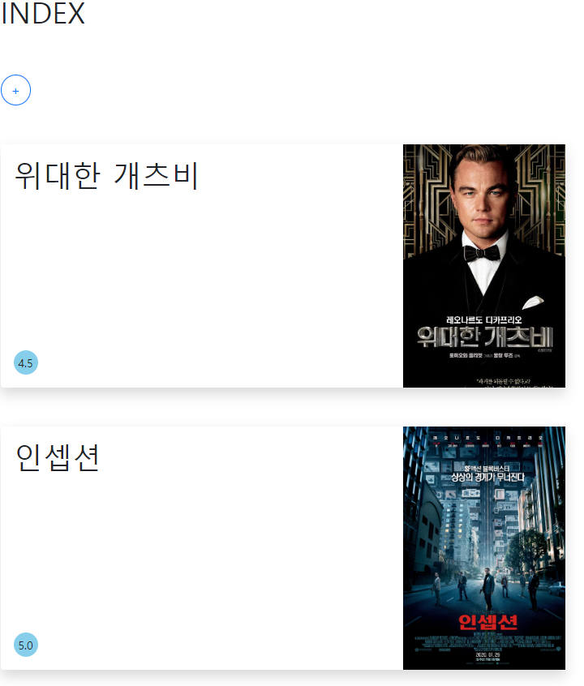
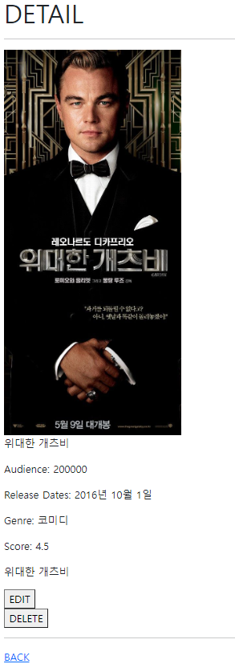
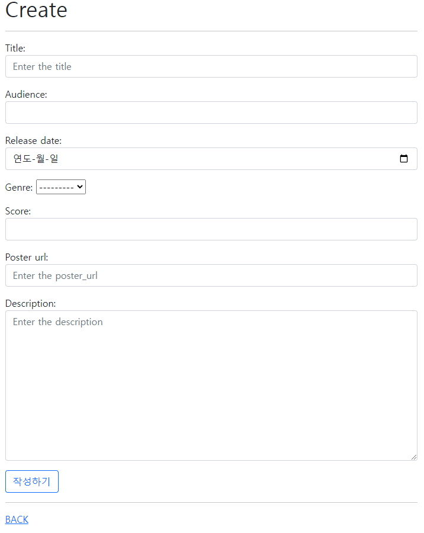
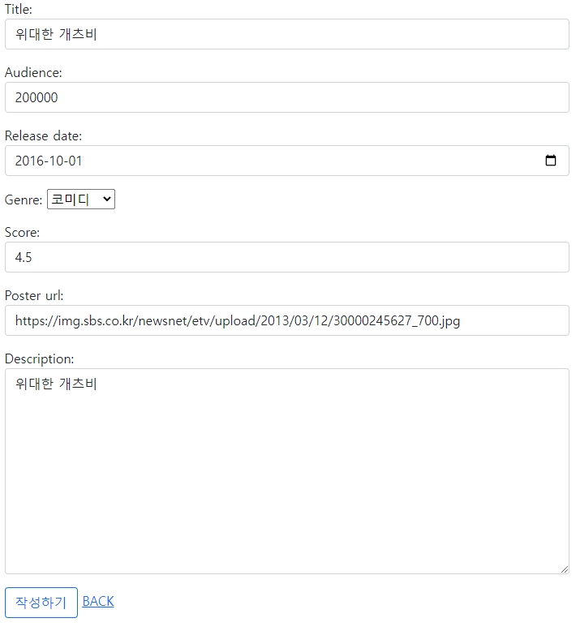

# PJT 06

## DB를 활용한 웹 페이지 구현

1. 목표 
   - 데이터를 생성, 조회, 수정, 삭제할 수 있는 Web application 제작
   - Django web framework를 통한 데이터 조작
   - ORM(Object Relational Mapping)에 대한 이해
   - Django ModelForm을 활용한 사용자 요청 데이터 유효성 검증


이번 실습은 이번주에 진행했던 Django 기반 웹 페이지 구현 수업과 비슷한 부분이 많아 다른 실습에 비해 덜 고생했다!! 교수님과 같이 여러번 반복해서 페이지를 만들다 보니 조금 익숙해진 것도 있는 것 같다.

전체적인 틀은 어제 Workshop과 저번 PJT05와 내용이 비슷했다.

먼저 가상환경에서 django 프로젝트와 앱을 생성했다. settings.py에 앱 이름을 넣어주는 것도 잊지 않았다.

그 후 모델 클래스를 정의하여 여러개의 영화 정보를 담을 수 있도록 해주었다. 파이썬 객체 지향 수업 때는 와닿지 않았는데, django를 배우면서 클래스에 대해 잘 알게 되는 것 같다. 모델 정의 후에 admin.py에서 admin site에 등록할 수 있도록 설정해주었다.

`/movies/` 경로일 때 앱 내 urls.py로 관리할 수 있도록 경로를 추가했고, 그 후 기본 페이지인 base.html을 기반으로 urls.py > views.py > indx.html 순으로 기본 페이지를 구성했다.



영화 제목과 평점, 포스터를 박스 형태로 표시했고, 클릭하면 상세 조회 페이지인 detail.html을 표시하도록 해주었다.

views.py의 detail 함수의 경우 Movie 클래스 내에서 선택한 영화의 정보를 가져와야 하기 때문에 pk를 이용했다.

get_object_or_404 함수는 영화의 정보 혹은 오류를 가져와주는 함수이다. 이번에 유효성 검사를 동시에 하기 편하게 하기 위해 사용했다.

```python
def detail(request, pk):
    movie = get_object_or_404(Movie, pk=pk)

    context = {
        'movie' : movie
    }

    return render(request, 'movies/detail.html', context)
```




➕버튼을 누르면 새로운 영화를 작성하는 new.html 페이지로 이동했다.

new.html 과 create 함수를 연동하여 Movie 클래스에 입력값을 받아 저장해주었다.

이 때 전에는 하나하나 input 입력 받는 변수들을 지정해줘야했지만 form을 사용하니 너무나 편리했다.

처음에는 장르 선택지를 어떻게 해야하는지 몰랐는데 구글링을 통해 이중튜플로 구현했다.

```python
def create(request):

    if request.method == 'POST':
        form = MovieForm(request.POST, request.FILES)
        if form.is_valid():
            form.save()
            messages.add_message(request, messages.SUCCESS, '글이 성공적으로 작성되었습니다.',fail_silently=True,)
            return redirect('movies:index')
    else:
        form = MovieForm()
        
    context = {
        'form' : form,
    }

    return render(request, 'movies/create.html', context)
```

models.py와 forms.py에서 input으로 받을 타입을 정해주고 modelform을 이용하니 훨씬 간편했다.

- models.py

```python
from django.db import models
from django import forms

# Create your models here.
class Movie(models.Model):

    title = models.CharField(max_length=20)
    audience = models.IntegerField()
    release_date = models.DateField()
    genre_choice = (('공포', '공포'), ('코미디', '코미디'), ('로맨스', '로맨스'))
    genre = models.CharField(max_length=30, choices=genre_choice)
    score = models.FloatField()
    poster_url = models.TextField()
    description = models.TextField()
```

- forms.py

```python
from django import forms
from .models import Movie

class MovieForm(forms.ModelForm):
    release_date = forms.DateField(widget=forms.DateInput(attrs={'class':'form-control', 'type':'date'}))
    score = forms.FloatField(min_value=0.0, max_value=5.0, widget=forms.NumberInput(attrs={'class':'form-control', 'step':'0.5'}))
    title = forms.CharField(
        widget=forms.TextInput(
            attrs={
                'class': 'my-title form-control',
                'placeholder': 'Enter the title'
            }
        )
    )
    audience = forms.FloatField(widget=forms.NumberInput(attrs={'class':'form-control'}))
    poster_url = forms.CharField(
        widget=forms.TextInput(
            attrs={
                'class': 'form-control',
                'placeholder': 'Enter the poster_url'
            }
        )
    )

    description = forms.CharField(
        widget=forms.Textarea(
            attrs={
                'class': 'my-content form-control',
                'placeholder': 'Enter the description'
            }
        )
    )

    class Meta:
        model = Movie
        fields = ('title', 'audience', 'release_date', 'genre', 'score', 'poster_url', 'description')
```

modelform을 이용했더니 유효성 검사가 편리했다.



create.html에서는 form과 csrf_token을 이용했다.

```html




<h1>Create</h1>
<hr>
<form action="" method='POST' enctype='multipart/form-data'>
  
  {{ form.as_p }}
  <button class='btn btn-outline-primary'>작성하기</button>
</form>
  <hr>
  <a href="">BACK</a>

</form>


```

update도 같은 형태에 instance만 추가해주었다.



```python
def update(request, pk):
    movie = get_object_or_404(Movie, pk=pk)

    if request.method == 'POST':
        form = MovieForm(request.POST, request.FILES, instance=movie)
        if form.is_valid():
            form.save()
            messages.add_message(request, messages.SUCCESS, '글이 성공적으로 수정되었습니다.',fail_silently=True,)
            return redirect('movies:detail', movie.pk)
    else:
        form = MovieForm(instance=movie)
        
    context = {
        'form' : form,
        'movie' : movie,
    }

    return render(request, 'movies/update.html', context)
```


마지막으로 delete 함수는 저번 프로젝트와 같았다. 다만 get_object_or_404 함수를 이용했다.

``` python
def delete(request, pk):
    movie = get_object_or_404(Movie, pk=pk)
    movie.delete()

    return redirect('movies:index')
```


오늘 실습을 통해 django의 CRUD 구조에 대해 다시 한번 다질 수 있어서 정말 좋은 시간이었다. 다음에 배우게 될 회원가입, 로그인 등의 기능들도 빨리 배워보고 싶다.

