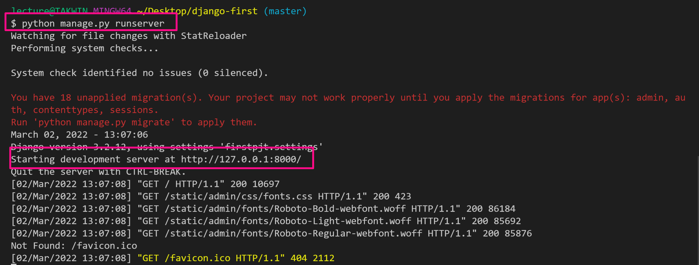
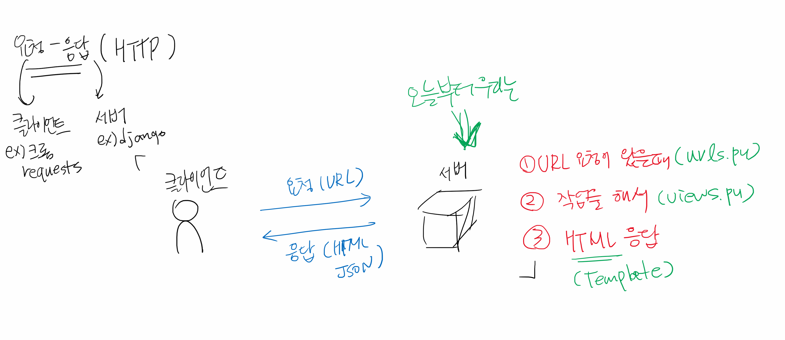

# Django 처음 시작하기

## 0. git 활용하기

## .gitignore

> git으로 프로젝트 내의 특정 파일/폴더를 관리하지 않기 위한 설정

* git은 프로젝트의 모든 파일/폴더의 변경사항을 관리함. 
* 개발시 개발 소스와 상관없는 파일/폴더(예- 운영체제, 개발환경(IDE, 에디터), 특정 프레임워크/라이브러리)를 `.gitignore`로 관리.
* 파이썬 예시 - [GitHub](https://github.com/github/gitignore/blob/main/Python.gitignore)

```
# Byte-compiled / optimized / DLL files => 실행시 발생하는 파일
__pycache__/
*.py[cod]
*$py.class

# C extensions
*.so

# Distribution / packaging
.Python
build/
develop-eggs/
dist/
downloads/
eggs/
.eggs/
lib/
lib64/
parts/
sdist/
var/
wheels/
share/python-wheels/
*.egg-info/
.installed.cfg
*.egg
MANIFEST

# PyInstaller
#  Usually these files are written by a python script from a template
#  before PyInstaller builds the exe, so as to inject date/other infos into it.
*.manifest
*.spec

# Installer logs
pip-log.txt
pip-delete-this-directory.txt

# Unit test / coverage reports
htmlcov/
.tox/
.nox/
.coverage
.coverage.*
.cache
nosetests.xml
coverage.xml
*.cover
*.py,cover
.hypothesis/
.pytest_cache/
cover/

# Translations
*.mo
*.pot

# Django stuff:
*.log
local_settings.py
db.sqlite3
db.sqlite3-journal

# Flask stuff:
instance/
.webassets-cache

# Scrapy stuff:
.scrapy

# Sphinx documentation
docs/_build/

# PyBuilder
.pybuilder/
target/

# Jupyter Notebook
.ipynb_checkpoints

# IPython
profile_default/
ipython_config.py

# pyenv
#   For a library or package, you might want to ignore these files since the code is
#   intended to run in multiple environments; otherwise, check them in:
# .python-version

# pipenv
#   According to pypa/pipenv#598, it is recommended to include Pipfile.lock in version control.
#   However, in case of collaboration, if having platform-specific dependencies or dependencies
#   having no cross-platform support, pipenv may install dependencies that don't work, or not
#   install all needed dependencies.
#Pipfile.lock

# poetry
#   Similar to Pipfile.lock, it is generally recommended to include poetry.lock in version control.
#   This is especially recommended for binary packages to ensure reproducibility, and is more
#   commonly ignored for libraries.
#   https://python-poetry.org/docs/basic-usage/#commit-your-poetrylock-file-to-version-control
#poetry.lock

# PEP 582; used by e.g. github.com/David-OConnor/pyflow
__pypackages__/

# Celery stuff
celerybeat-schedule
celerybeat.pid

# SageMath parsed files
*.sage.py

# Environments => 가상환경
.env
.venv
env/
venv/
ENV/
env.bak/
venv.bak/

# Spyder project settings
.spyderproject
.spyproject

# Rope project settings
.ropeproject

# mkdocs documentation
/site

# mypy
.mypy_cache/
.dmypy.json
dmypy.json

# Pyre type checker
.pyre/

# pytype static type analyzer
.pytype/

# Cython debug symbols
cython_debug/

# PyCharm => IDE 쓰는 경우 활용!
#  JetBrains specific template is maintained in a separate JetBrains.gitignore that can
#  be found at https://github.com/github/gitignore/blob/main/Global/JetBrains.gitignore
#  and can be added to the global gitignore or merged into this file.  For a more nuclear
#  option (not recommended) you can uncomment the following to ignore the entire idea folder.
#.idea/
```

* 이외에도 https://gitignore.io/ 사이트에서 운영체제(mac, windows), 개발환경(Pycharm, visual studio code), 특정 언어 및 환경(Python, Django, Jupyternotebook)을 입력하여 조합된 결과를 활용할 수 있다.

* 예시 - `django`, `visual studio code`, `windows` [링크](https://www.toptal.com/developers/gitignore/api/django,visualstudiocode,windows)

```

# Created by https://www.toptal.com/developers/gitignore/api/django,visualstudiocode,windows
# Edit at https://www.toptal.com/developers/gitignore?templates=django,visualstudiocode,windows

### Django ###
*.log
*.pot
*.pyc
__pycache__/
local_settings.py
db.sqlite3
db.sqlite3-journal
media

# If your build process includes running collectstatic, then you probably don't need or want to include staticfiles/
# in your Git repository. Update and uncomment the following line accordingly.
# <django-project-name>/staticfiles/

### Django.Python Stack ###
# Byte-compiled / optimized / DLL files
*.py[cod]
*$py.class

# C extensions
*.so

# Distribution / packaging
.Python
build/
develop-eggs/
dist/
downloads/
eggs/
.eggs/
lib/
lib64/
parts/
sdist/
var/
wheels/
share/python-wheels/
*.egg-info/
.installed.cfg
*.egg
MANIFEST

# PyInstaller
#  Usually these files are written by a python script from a template
#  before PyInstaller builds the exe, so as to inject date/other infos into it.
*.manifest
*.spec

# Installer logs
pip-log.txt
pip-delete-this-directory.txt

# Unit test / coverage reports
htmlcov/
.tox/
.nox/
.coverage
.coverage.*
.cache
nosetests.xml
coverage.xml
*.cover
*.py,cover
.hypothesis/
.pytest_cache/
cover/

# Translations
*.mo

# Django stuff:

# Flask stuff:
instance/
.webassets-cache

# Scrapy stuff:
.scrapy

# Sphinx documentation
docs/_build/

# PyBuilder
.pybuilder/
target/

# Jupyter Notebook
.ipynb_checkpoints

# IPython
profile_default/
ipython_config.py

# pyenv
#   For a library or package, you might want to ignore these files since the code is
#   intended to run in multiple environments; otherwise, check them in:
# .python-version

# pipenv
#   According to pypa/pipenv#598, it is recommended to include Pipfile.lock in version control.
#   However, in case of collaboration, if having platform-specific dependencies or dependencies
#   having no cross-platform support, pipenv may install dependencies that don't work, or not
#   install all needed dependencies.
#Pipfile.lock

# poetry
#   Similar to Pipfile.lock, it is generally recommended to include poetry.lock in version control.
#   This is especially recommended for binary packages to ensure reproducibility, and is more
#   commonly ignored for libraries.
#   https://python-poetry.org/docs/basic-usage/#commit-your-poetrylock-file-to-version-control
#poetry.lock

# PEP 582; used by e.g. github.com/David-OConnor/pyflow
__pypackages__/

# Celery stuff
celerybeat-schedule
celerybeat.pid

# SageMath parsed files
*.sage.py

# Environments
.env
.venv
env/
venv/
ENV/
env.bak/
venv.bak/

# Spyder project settings
.spyderproject
.spyproject

# Rope project settings
.ropeproject

# mkdocs documentation
/site

# mypy
.mypy_cache/
.dmypy.json
dmypy.json

# Pyre type checker
.pyre/

# pytype static type analyzer
.pytype/

# Cython debug symbols
cython_debug/

# PyCharm
#  JetBrains specific template is maintained in a separate JetBrains.gitignore that can
#  be found at https://github.com/github/gitignore/blob/main/Global/JetBrains.gitignore
#  and can be added to the global gitignore or merged into this file.  For a more nuclear
#  option (not recommended) you can uncomment the following to ignore the entire idea folder.
#.idea/

### VisualStudioCode ###
.vscode/*
!.vscode/settings.json
!.vscode/tasks.json
!.vscode/launch.json
!.vscode/extensions.json
!.vscode/*.code-snippets

# Local History for Visual Studio Code
.history/

# Built Visual Studio Code Extensions
*.vsix

### VisualStudioCode Patch ###
# Ignore all local history of files
.history
.ionide

# Support for Project snippet scope

### Windows ###
# Windows thumbnail cache files
Thumbs.db
Thumbs.db:encryptable
ehthumbs.db
ehthumbs_vista.db

# Dump file
*.stackdump

# Folder config file
[Dd]esktop.ini

# Recycle Bin used on file shares
$RECYCLE.BIN/

# Windows Installer files
*.cab
*.msi
*.msix
*.msm
*.msp

# Windows shortcuts
*.lnk

# End of https://www.toptal.com/developers/gitignore/api/django,visualstudiocode,windows
```


## 1. 가상환경

> 프로젝트별로 pip로 설치되는 패키지를 독립적으로 관리하기 위하여 

### 가상환경 생성

```bash
$ python -m venv venv
```

### 가상환경 실행

* `venv` 폴더 내의 스크립트를 실행 시키는 것

```bash
$ source venv/Scripts/activate
(venv)
```

### 가상환경 종료

```bash
$ deactivate
```

## 2. Django 설치

```bash
$ pip install django==3.2.12
```

* 혹시라도 4.x 버전을 설치한 경우 삭제 후 재설치 

```bash
$ pip uninstall django
```

## 3. Django 서버 실행

* 서버 종료는 `ctrl + c` 로 한다.

```bash
$ python manage.py runserver
```



## 4. Django 개발하기

> 각 App에 MTV에 해당하는 기능을 구현한다.

### app 생성

```bash
$ python manage.py startapp 앱이름
```

* app  생성을 하면, 바로 등록을 진행한다.

```python
# firstpjt/settings.py
INSTALLED_APPS = [
    '앱이름',
    'django.contrib.admin',
    'django.contrib.auth',
    'django.contrib.contenttypes',
    'django.contrib.sessions',
    'django.contrib.messages',
    'django.contrib.staticfiles',
]

```

### 기본 개발 흐름




#### 1) URL 설정

* URL과 해당 URL로 요청오면 실행시킬 view의 함수를 지정한다.
* Variable routing을 하는 경우 views.py에서 함수 파라미터로 받아야한다.

```python
from django.contrib import admin
from django.urls import path
# aritlces 앱의 views.py
from articles import views

urlpatterns = [
    path('admin/', admin.site.urls),
    # URL을 index/ 들어오면, 
    # index 함수를 실행시킬 것이다.
    path('index/', views.index),
    path('bts/', views.bts),
]

```

#### 2) views.py

* 함수를 정의할 때 반드시 첫번째는 `request`

  * request 객체 정보 : https://docs.djangoproject.com/en/3.2/ref/request-response/

  * 출력 예시

      ```
        ['COOKIES', 'FILES', 'GET', 'META', 'POST', '__class__', '__delattr__', '__dict__', '__dir__', '__doc__', '__eq__', '__format__', '__ge__', '__getattribute__', '__gt__', '__hash__', '__init__', 
        '__init_subclass__', '__iter__', '__le__', '__lt__', '__module__', '__ne__', '__new__', '__reduce__', '__reduce_ex__', '__repr__', '__setattr__', '__sizeof__', '__str__', '__subclasshook__', '__weakref__', '_current_scheme_host', '_encoding', '_get_full_path', '_get_post', '_get_raw_host', 
        '_get_scheme', '_initialize_handlers', '_load_post_and_files', '_mark_post_parse_error', '_messages', '_read_started', '_set_content_type_params', '_set_post', '_stream', '_upload_handlers', 'accepted_types', 'accepts', 'body', 'build_absolute_uri', 'close', 'content_params', 'content_type', 'csrf_processing_done', 'encoding', 'environ', 'get_full_path', 'get_full_path_info', 'get_host', 'get_port', 'get_raw_uri', 'get_signed_cookie', 'headers', 'is_ajax', 'is_secure', 'method', 'parse_file_upload', 'path', 'path_info', 'read', 'readline', 'readlines', 'resolver_match', 'scheme', 'session', 'upload_handlers', 'user']
      ```

* 함수 return은 `render` 함수 활용

  * https://docs.djangoproject.com/ko/3.2/topics/http/shortcuts/#render
  * 필수 인자
    * request
    * template 이름

```python
# index 함수는
# 어떠한 작업을 하고 (아직 쓰지 않음)
# index.html을 랜더링할 것이다.
def index(request):
    # 작업
    return render(request, 'index.html')
```

#### 3) templates

* templates 폴더는 반드시 app 폴더 내부에 생성한다.

```html
<!-- articles/templates/index.html -->
<h1>안녕</h1>
```


## 5. Template 활용하기

* 템플릿 설정

  ```python
  TEMPLATES = [
      {
          'BACKEND': 'django.template.backends.django.DjangoTemplates',
          # 추가할 디렉토리
          'DIRS': [BASE_DIR / 'templates'],
          # 등록된 app의 templates 폴더를 모두 
          'APP_DIRS': True,
          'OPTIONS': {
              'context_processors': [
                  'django.template.context_processors.debug',
                  'django.template.context_processors.request',
                  'django.contrib.auth.context_processors.auth',
                  'django.contrib.messages.context_processors.messages',
              ],
          },
      },
  ]
  ```

* 템플릿 태그

  ```django
  {{ lunch_menu }}
  ```

  ```django
  
  
  ```

* 템플릿 필터 

  ```django
  {{ lunch_box|length }}
  ```

* 템플릿 상속

  * 어떤 템플릿을 상속 받을지
  * 템플릿의 어떤 블록에 해당하는 내용인지

  ```django
  
  
  
  행운로또
  
  
  
  <h1>로또 번호입니다.</h1>
  <h2>{{ lotto }}</h2>
  
  ```

  

## 6. App 단위 설정하기

```python
from django.contrib import admin
from django.urls import path, include

urlpatterns = [
    path('admin/', admin.site.urls),
    path('articles/', include('articles.urls')),
    path('pages/', include('pages.urls')),
]
```

```python
from django.urls import path
from . import views

app_name = 'articles'

urlpatterns = [
    path('index/', views.index, name='index'),
    path('bts/', views.bts, name='bts'),
    path('lotto/', views.lotto, name='lotto'),
    path('mbti/', views.mbti, name='mbti'),
    path('lunch/', views.lunch, name='lunch'),
    path('throw/', views.throw, name='throw'),
    path('catch/', views.catch, name='catch'),
    path('blog/<int:id>/', views.blog),
    path('hello/<name>/', views.hello),
]
```

* app_name과 urlpattern의 이름을 바탕으로 URL을 작성할 수 있다.

```python
<form action="" method="GET">
```


## 관련 문서 정리

| 개념              | 링크                                                         | 비고     |
| ----------------- | ------------------------------------------------------------ | -------- |
| render            | https://docs.djangoproject.com/ko/3.2/topics/http/shortcuts/#render | views    |
| request object    | https://docs.djangoproject.com/en/3.2/ref/request-response/  | views    |
| URL               | https://docs.djangoproject.com/ko/3.2/topics/http/urls/#path-converters | url      |
| template tag      | https://docs.djangoproject.com/en/3.2/ref/templates/builtins/ | template |
| HTTP              | https://developer.mozilla.org/ko/docs/Web/HTTP               | HTTP     |
| template settings | https://docs.djangoproject.com/en/4.0/ref/settings/#templates | settings |


