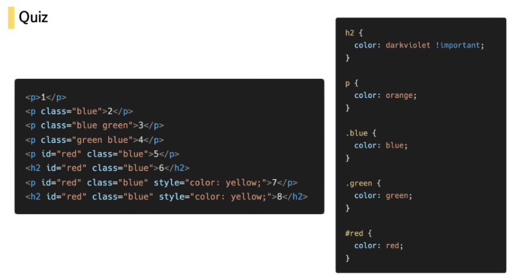

## HTML

- HTML 문서의 기본구조

    - html : 문서의 최상위(root) 요소

    - head : 문서 메타 데이터 요소

        - 문서 제목, 인코딩, 스타일, 외부 파일 로딩 등
        - 일반적으로 브라우저에 나타나지 않는 내용
        - `<title> <meta> <link> <script> <style>`

    - body : 문서 본문 요소

        - 실제 화면 구성과 관련된 내용

        ```html
        <!DOCTYPE html>
        <html lang="en">
        <head>
          <meta charset="UTF-8">
          <meta http-equiv="X-UA-Compatible" content="IE=edge">
          <meta name="viewport" content="width=device-width, initial-scale=1.0">
          <title>Document</title>
        </head>
        <body>
          
        </body>
        </html>
        ```

- DOM(Document Object Model)

    

- 시맨틱 태그

    - div 대신 사용하는 의미론적 요소를 담은 태그
        - `header` : 문서 전체나 섹션의 헤더
        - `nav` : 내비게이션
        - `aside` : 사이드에 위치한 공간, 메인 콘텐츠와 관련성이 적은 콘텐츠
        - `section` : 문서의 일반적인 구분, 컨텐츠의 그룹을 표현
        - `article` : 문서, 페이지, 사이트 안에서 독립적으로 구분되는 영역
        - `footer` : 문서 전체나 섹션의 푸터(마지막 부분)

    - `div, span` 등은 Non-sementic요소 / `h1, table`은 sementic 태그
    - 가독성을 높이고 유지보수를 쉽게 함

    

- 주요 태그와 속성

    - ~~table, form, input X~~
    - 공백 No, 쌍따옴표 "" 사용
    - 공통 속성
      - `id` : 문서 전체에서 유일한 고유 식별자 지정
      - `class` : 공백으로 구분된 해당 요소의 클래스 목록
      - `style` : inline 스타일
      - `title` : 요소에 대한 추가 정보 지정
    - 내용이 없는 태그들
      - `<br> <hr>  <link> <input> <meta>`
    - 요소는 중첩될 수 있음

## CSS

- 단위(크기, 속성)

    - em - 바로 위(부모 요소) 상속의 영향을 받음, 배수 단위
    - rem - 상속의 영향을 받지 않음, 최상위 요소(html) 사이즈를 기준으로 배수 단위
    - viewport - 유저에게 보이게 되는 영역 (디바이스 화면)의 viewport를 기준으로 상대적 사이즈 결정

- 선택자 및 우선순위

    - 요소 선택자 - HTML 태그를 직접 선택

    - 클래스(class) 선택자 - 마침표(.) 문자로 시작하며, 해당 클래스가 적용된 항목을 선택

    - 아이디(id) 선택자 - # 문자로 시작하며, 해당 아이디가 적용된 항목을 선택, 일반적으로 하나의 문서에 1번만 사용, 여러번 사용해도 동작하지만, 단일 id를 사용하는 것을 권장

    - 우선순위(!!!!!)

        - ! important > 인라인 > id > class, 속성, (pseudo-class) > 요소, (pseudo-element) > CSS 파일 로딩 순서(윗줄부터 적용해서 아래에서 덮어쓸 수 있음)

            

    - CSS는 상속을 통해 부모 요소의 속성을 자식에게 상속한다.

        - 속성(프로퍼티) 중에는 상속이 되는 것과 되지 않는 것들이 있다.
        - 상속 되는 것 - Text 관련 요소 (font, color, text-align), opacity, visibility 등
        - 상속 되지 않는 것 - Box model 관련 요소 (width, height, margin, padding, box-sizing, display), position 관련 요소 (position, top/right/bottom/left, z-index) 등

    - 결합자는 나오면 틀리겠습니다...필요하신 분들은 01.web에(첫번째) 118page부터 보시면 됩니다..

- 박스 모델

    - 모든 요소는 박스모델, 위에서부터 아래로, 왼쪽에서 오른쪽으로 쌓인다.

    - 하나의 박스는 content, padding, border, margin 네 영역으로 이루어짐

    - 

    - margin, padding은 1~4개의 요소를 가질 수 있다.

        - 1개 - 전체 동시 적용

        - 2개 - (상, 하), (좌, 우)로 적용

        - 3개 - 상, (좌, 우), 하로 적용

        - 4개 - 상, 우, 하, 좌로 적용(시계방향;)

            

    - 기본적으로 모든 요소의 box-sizing은 padding을 제외한 순수 contents 영역만을 box로 지정한다.

    - 우리가 원하는 border까지의 너비를 지정하고 싶으면 box-sizing을 border-box로 설정한다.

- 인라인, 블록 요소 특징

    - display : block
        - 줄 바꿈이 일어나는 요소
        - 화면 크기 전체의 가로 폭을 차지한다.
        - 블록 레벨 요소 안에 인라인 레벨 요소가 들어갈 수 있음.

    - display : inline
        - 줄 바꿈이 일어나지 않는 행의 일부 요소
        - content 너비만큼 가로 폭을 차지한다.
        - width, height, margin-top, margin-bottom을 지정할 수 없다.
        - 상하 여백은 line-height로 지정한다.

    - display : inline - block
        - block과 inline 레벨 요소의 특징을 모두 가짐
        - inline처럼 한 줄에 표시 가능하고 block처럼 width, height, margin 속성을 모두 지정할 수 있음

    - display : none
        - 해당 요소를 화면에 표시하지 않음, 공간도 부여 X
        - visibility : hidden은 공간은 차지하지만 표시만 X

- Position
    - static : 모든 태그의 기본 값(기준 위치)
    - 아래는  좌표 프로퍼티(top, bottom, left, right)를 사용하여 이동 가능
      - relative : 상대 위치 - 자기 자신의 static 위치를 기준으로 이동
      - absolute (out of flow) : 절대 위치 - 레이아웃에 공간을 차지하지 않음, static이 아닌 가장 가까이 있는 부모/조상 요소를 기준으로 이동(없는 경우 body)
      - fixed (out of flow) : 고정 위치 - 부모 요소와 관계 없이 viewport를 기준으로 이동 (스크롤 시에도 같은 곳에 위치)
    - sticky

- Flex

    - justify, align content - 주축, 부축 기준

        - flex-direction : main axis 기준 방향 설정 (`row, row-reverse, column, column-reverse`)

        - flex-wrap : 컨테이너를 벗어나는 경우 해당 영역 내에 배치되도록 크기 조정(줄 바꿈 느낌)

        - justify-content : 주축 기준

            

        - align- content : 부축 기준

            

        - align-self : 개별 아이템에 적용!


# 반응형 웹

- Bootstrap
    - Grid System
      - 요소들의 디자인과 배치에 도움을 주는 시스템
        - column : 실제 컨텐츠를 포함하는 부분
        - gutter : column 사이의 공간
        - container : column들을 담고 있는 공간
    - Breakpoint
      - 12개의 column, 6개의 grid breakpoints

## 마크업

- 각 태그별 속성
  - 인라인, 블록
  - `li` ⇒ list-style....


## 스타일링

- 레이아웃
    - Position
        - 네모 위 네모 → absolute
        - 브라우저기준 → fixed, sticky
    - Flex
    - Bootstrap Grid System

## 스타일

- color
- size
- 각 태그별 속성..